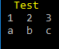

py-printer
==========
Printing everything for everyone!

.. image:: https://img.shields.io/pypi/v/pyprinter.svg
    :target: https://pypi.python.org/pypi/pyprinter
    :alt: Latest Version

.. image:: https://travis-ci.org/ofir123/py-printer.svg
   :target: https://travis-ci.org/ofir123/py-printer
   :alt: Travis CI build status

:Project page: https://github.com/ofir123/py-printer

Usage
-----
| The perfect printer for Python 3!
|
| Just create a printer instance, pick your favorite colors and get to work!
| py-printer supports all ANSI colors, and crazy encodings!
| It also calculates the console width in order to wrap words properly.
|

.. code:: python

    import pyprinter

    printer = pyprinter.get_printer()

    # Write a simple line.
    printer.write_line(printer.YELLOW + 'Hello World!')

    # Or use the color functions (nested coloring is also supported).
    printer.write_line(printer.yellow('Hello World!'))

.. code:: python

    # Use indentations.
    with printer.group(indent=4):
        printer.write_line(printer.GREEN + 'Hello Again!')

.. code:: python

    # Write aligned values.
    printer.write_aligned('Awesomeness', 'Check!')

.. code:: python

    # Write titles.
    printer.write_title('Wow!')

.. code:: python

    # Print human-readable file sizes.
    from pyprinter import FileSize

    FileSize(42352352).pretty_print()

.. code:: python

    # Use tables.
    from pyprinter import Table

    Table('Test', [{'1': 'a', '2': 'b', '3': 'c'}]).pretty_print()

.. code:: python

    # Integrate friendly progress bars.
    import time
    from pyprinter import ProgressBar

    progress = ProgressBar(10)
    for i in range(10):
        time.sleep(1)
        progress.eval(i)
    progress.finish()

.. code:: python

    # Use word-wrapping or colors only.
    printer = pyprinter.get_printer(colors=False, width_limit=True)
    printer.write_line(printer.YELLOW + 'Hello World!')

.. image:: docs/images/no_colors.png

Install
^^^^^^^
``pip install pyprinter``

Development
^^^^^^^^^^^
In order to build a new version, do the following:

    - Update version string in ``setup.py`` (in both ``version`` and ``download_url`` fields)
    - Update version in ``__init__.py`` file.
    - Run ``python setup.py sdist bdist_wheel`` to create the build
    - Run ``twine upload dist/*`` to upload everything to PyPi
    - Create a release (and tag) for the new version in GitHub (and delete the old one)
    - Delete old version from PyPi as well
